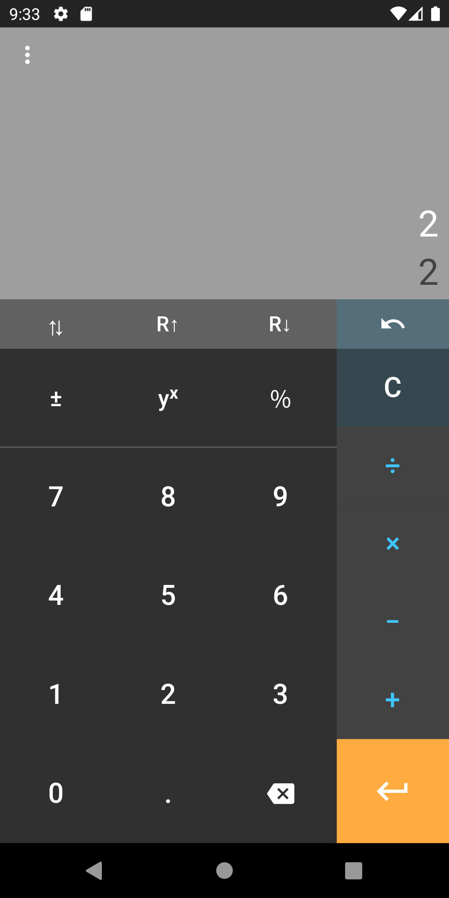
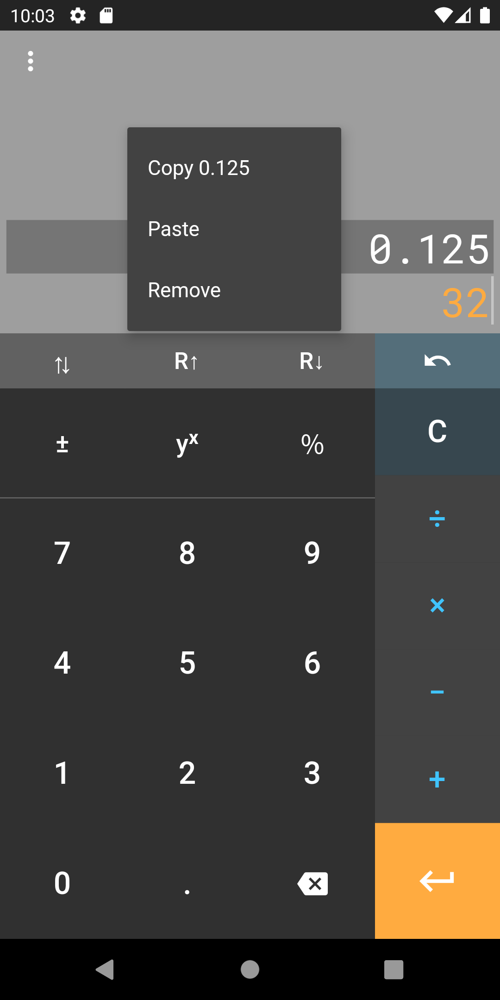

#  RPNcalc 

A simple, modern calculator that uses RPN.

[Reverse Polish Notation](https://en.wikipedia.org/wiki/Reverse_Polish_notation) is a 
system where the operators are entered _after_ the operands. 

For example, rather than 2 + 2, you would enter:
 
    2
    2
    + 

The main benefit is a faster, more accurate interface:

> Reverse Polish calculators do not need expressions to be
> parenthesized, so fewer operations need to be entered to perform typical calculations.
> Additionally, users of reverse Polish calculators made fewer mistakes than for other
> types of calculators.

(from the Wikipedia article above).

## Future work

- Scientific mode (trig functions, logarithms, etc.)
- Persistent history
- iOS release
- macOS version

