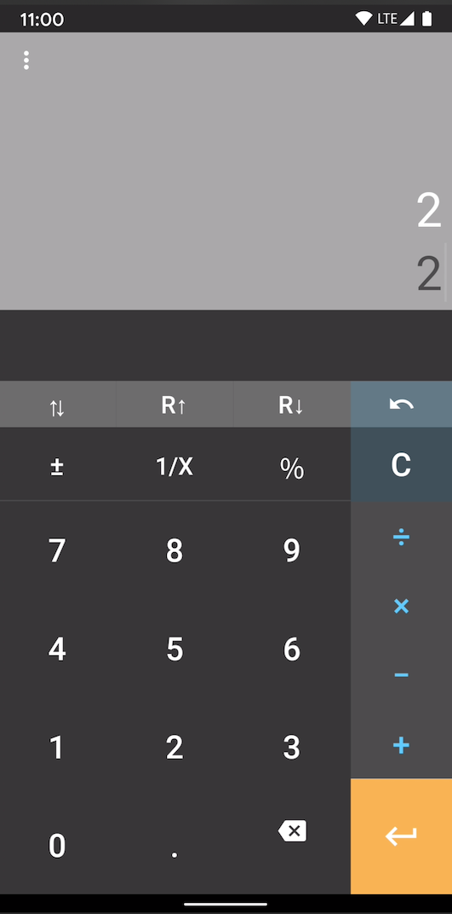

# RPNcalc 

A simple, modern RPN calculator. 

[Reverse Polish Notation](https://en.wikipedia.org/wiki/Reverse_Polish_notation) is a 
system where the operators are entered _after_ the operands. 

For example, rather than 2 + 2, you would enter:
 
    2
    2
    + 

The main benefit is a faster, more accurate interface:

>Reverse Polish calculators do not need expressions to be 
>parenthesized, so fewer operations need to be entered to perform typical calculations. 
>Additionally, users of reverse Polish calculators made fewer mistakes than for other 
>types of calculators.

(from the Wikipedia article above).

## Future work
- Scientific mode
- Persistent history
- iOS release
